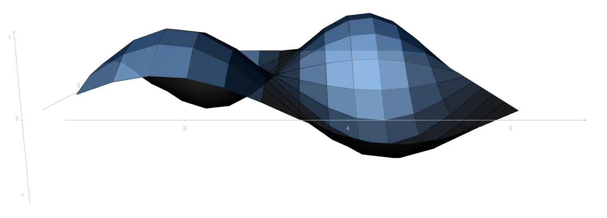
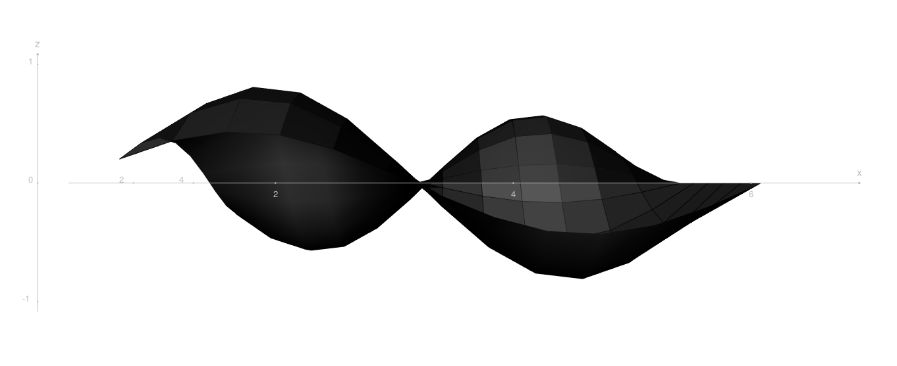
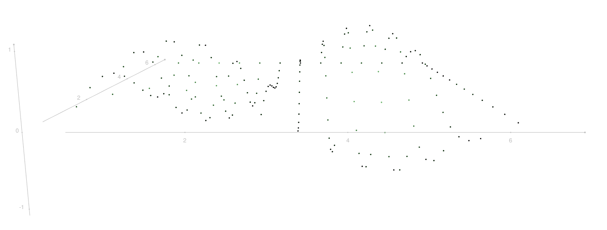
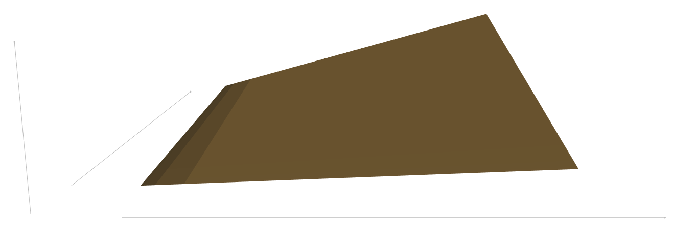
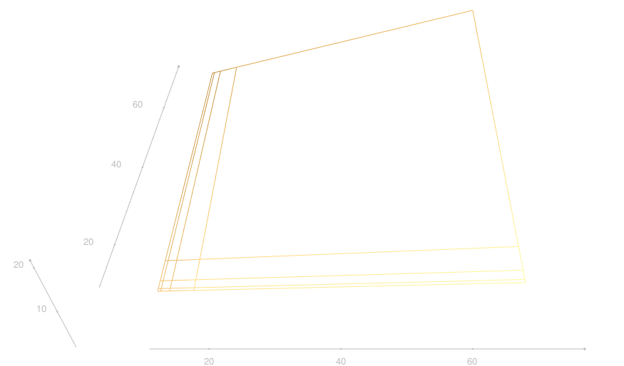

```{r setup, include=FALSE}
knitr::opts_chunk$set(echo = TRUE)
```

## About the package:

The **kh3d** package is a wrapper to plot 3d surfaces using the **R** package [**rgl**](https://cran.r-project.org/web/packages/rgl/index.html) that also depends on the **tidyverse**.

The core of the code was copied from [sthda](http://www.sthda.com/english/wiki/a-complete-guide-to-3d-visualization-device-system-in-r-r-software-and-data-visualization) and than modified.

Currently this is a *one function package*, providing the funtion `kh3_plot()` which will takes a 3-column tibble (with the columns x,y & z) and plots the according 3d surface.

```{r, message = FALSE}
library(kh3d)

n_steps <- 13
wave <- tibble(x = 2*pi*(1:n_steps)/n_steps,
               y = x) %>%
  purrr::cross_df() %>%
  mutate( z = sin(x)*sin(y))

wave
```

The parameter `aspect` defines the aspect rario of the axes x,y & z.

```{r ,eval = FALSE}
wave %>%
  kh3_plot(.,aspect = c(1,1,1))
```



Further parameters define the surfcae color, the axis labels, the surface *shininess* and the view angle.
(Many of those parameters are original **rgl** parameters that will be passed on to `rgl::surface3d()`.)

```{r ,eval = FALSE}
wave %>%
  kh3_plot(.,
           color = rgb(.1,.1,.1), 
           xlab = 'x',
           ylab = 'y',
           zlab = 'z',
           aspect = c(1,1,1),
           shininess = 4,
           phi = -90)
```



The are three different `style[s]` (surface, lines & points).
This parameter switches the surface apparence. 

```{r ,eval = FALSE}
wave %>%
  kh3_plot(., color = 'darkgreen', 
           aspect = c(1,1,1),
           style = 'points',
             shininess = 4)
```



It is possible to omit the axis ticks and the lines drawn onto the surface by toggeling `show_ticks` and `line_overlay` to `FALSE`.

```{r ,eval = FALSE}
board <- tibble(x = rep(c(1,1.05,1.2,1.6,7),5)*10,
       y = rep(c(1,1.05,1.2,1.6,7),each = 5)*10,
       z = x*y/250)

board  %>%
  kh3_plot(., color = kh_clr[2],
           show_ticks = FALSE,
           line_overlay = FALSE,
           aspect = c(1,1,1),
           style = 'surface',
           shininess = 4)
```



For completenes, here is an example of the `line` plot-type.

```{r ,eval = FALSE}
board  %>%
  kh3_plot(., color = kh_clr[2], 
           aspect = c(1,1,1),
           style = 'lines',
           shininess = 4,phi = -50)

```



------------------------

<center>

</center>
